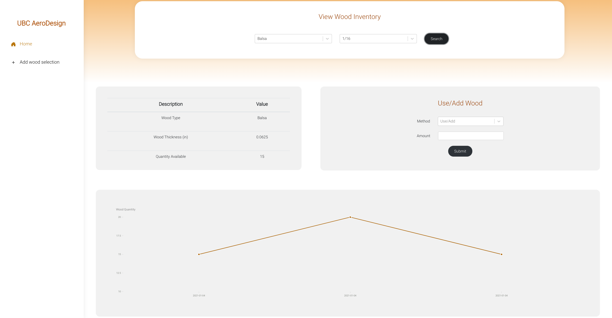
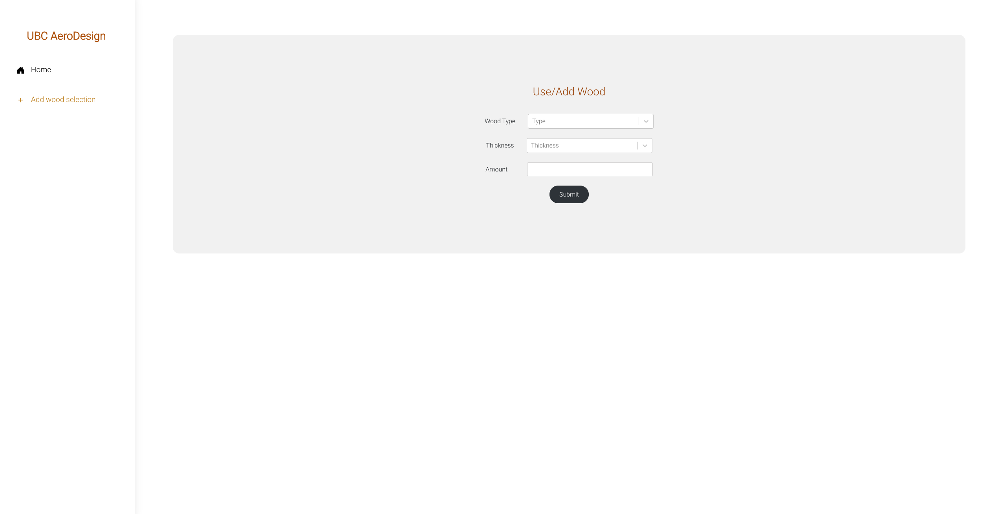

# Wood Tracker

The drive for this project was to simplify and provide intuitive data visualization of the wood inventory for UBC AeroDesign. A wood inventory tracking system allows UBC AeroDesign to track wood consumption when constructing a plane to predict future wood demands and ensure a reasonable wood supply for laser cutting.

The web application allows users to search for different types of wood in the inventory and manage the wood quantity. Users can view a log of the wood quantity over time for trend analysis and wood demand predictions. If a new type of wood has not been added to the system, the user can append the wood type into the inventory.

